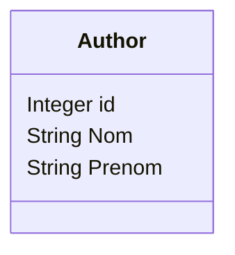

Cette application type présente comment accéder à une source de données en isolant l'accès bas niveau dans des classes **DAO** (Data Access Object).

C'est un projet Maven à récupérer sur gitlab.
Il nécessite Java 17, Maven, et un éditeur de type Visual Studio Code (ou autres))

Vous aurez à compléter le code des DAO et des services. Les tests des services sont déjà opérationnels.
Le modèle de données est ici très simple:

Le projet est décomposé en plusieurs répertoires (pas de modules):

* data: le modèle de données (format POJO)
* dao: la classe DAO avec les méthodes CRUD bas niveau (accès JDBC/SQL)
* service: la classe qui fournit les services d'accès aux données (ici mappé sur les accès CRUD du DAO, mais toutes les fonctionnalités/transactions sont à placer ici)
* tool: des classes outils pour ouvrir une connexion avec une BD, gérer des sessions transactionnelles pour les services, une classe qui fournit des méthodes E/S clavier simplifiées au besoin.
* App.java: un exemple de programme simpliste (le code métier sera à placer dans des classes controleurs d'un vrai projet)

Le répertoire test contient AppTest.java qui décrit l'ensemble des tests à réaliser sur les services.

Vous ne modifierez que les dao et service dans ce TP.

Vous devrez forker ce repository sur votre compte github ou gitlab (bouton fork) )puis cloner votre fork (git clone )et pousser les changements au fur et à mesure.

Pour préparer proprement votre projet:
*mvn clean install* (dans le répertoire du projet)
et pour les tests:
*mvn test*
ou en utilisant les plugins de votre IDE.

Le code contient quelques exemples pour (création d'un utilisateur).

Vous pourrez ensuite créer des tests pour les DAO afin de tester tous le sniveaux de votre application (ici uniquement les services sont implémentés).
Vous pourrez aussi créer une méthode DAO pour chercher une liste d'utilisateurs par le nom d'utilisateur, et développez service et tests en relation.
